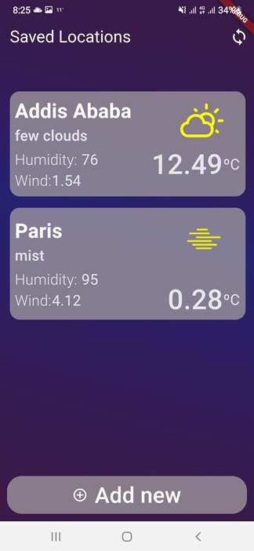
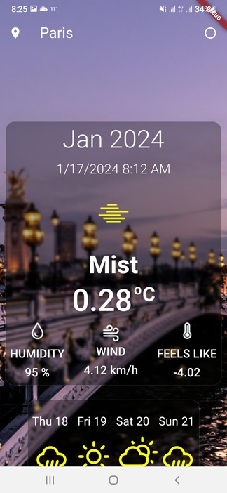

# Flutter Weather App






The Weather App is a comprehensive mobile application that offers a wide range of features to provide users with accurate and up-to-date weather information for cities around the world. This app utilizes the OpenWeather API for retrieving real-time weather data and the Unsplash API to fetch stunning city images. The project is developed using Flutter and incorporates industry best practices, including BLoC state management, clean architecture, and strict adherence to Flutter development guidelines. It's worth mentioning that the design and project selection for this app were sourced from the competition hosted on heyflutter.com, with all credits going to HeyFlutter.

## Features

1. Weather Forecast: Users can search for cities and view detailed weather forecasts, including current weather conditions, temperature, humidity, wind speed, and precipitation. The app utilizes the OpenWeather API to fetch reliable and real-time weather data.

2. City Images: Enhancing the visual experience, the Weather App fetches captivating city images from the Unsplash API, providing users with a glimpse of the searched location's atmosphere and scenery.

3. Internet Connectivity Check: The app incorporates a robust mechanism to check the device's internet connectivity. It ensures that users receive the most recent weather data by handling offline scenarios gracefully and providing appropriate feedback to the user when there is no internet connection available.

4. Best Routing Practice: The Weather App employs best routing practices to ensure smooth navigation between different screens. It utilizes Flutter's built-in navigation system and follows the recommended navigation patterns for a seamless user experience.

5. Save City and Weather Information: Users can save their favorite cities to easily access their weather information. The app allows users to store and manage a list of preferred cities, enabling them to quickly retrieve weather forecasts for those locations without the need for repeated searches.

6. Home Screen Widget with Live Weather Icon: The Weather App includes a home screen widget that displays the current weather conditions and a live weather icon. Users can add this widget to their device's home screen for convenient access to real-time weather updates without opening the app.

7. Weather Transitions: Lottie animations are utilized to create smooth and visually pleasing transitions between different weather conditions. For example, when the weather changes from sunny to rainy, a delightful animation can be displayed to depict the transition, providing users with an engaging and immersive experience.

8. Loading Animations: Lottie animations are employed to display visually appealing loading animations during data fetching processes. This ensures that users are aware of ongoing tasks in the background, such as retrieving weather information or loading city images. The animations not only entertain users during waiting times but also indicate that the app is actively working to provide the requested data.


## Unimplemented 1
This feature aims to handle scenarios where there is no internet connection available. In such cases, the application should load the city data from the local database instead of making network requests. Additionally, the feature includes the ability to delete the saved city list and customize the user interface (UI) accordingly.

## Functionality
When the application detects no internet connection, it should retrieve city data from the local database.
The local database serves as a fallback mechanism when internet connectivity is unavailable.
Users have the option to delete the saved city list, providing a fresh start for adding new cities.
The UI can be customized based on the requirements and design guidelines of the application.

## Unimplemented 2
And also sync every couple of seconds
## Unimplemented 3
Multi language
## API Reference

#### Get city weather condition

```http
  GET https://api.openweathermap.org/data/2.5/weather  with query params
```

| Parameter | Type     | Description                |
| :-------- | :------- | :------------------------- |
| `api_key` | `string` | **Required**. Your API key |

#### Get city image from unsplash

```http
  GET https://api.unsplash.com/search/photos
```

| Parameter | Type     | Description                       |
| :-------- | :------- | :-------------------------------- |
| `id`      | `string` | **Required**. Id of item to fetch |


## Documentation

[OpenWeatherAPI](https://openweathermap.org/api)

[unsplash](https://unsplash.com/developers)

## Demo


